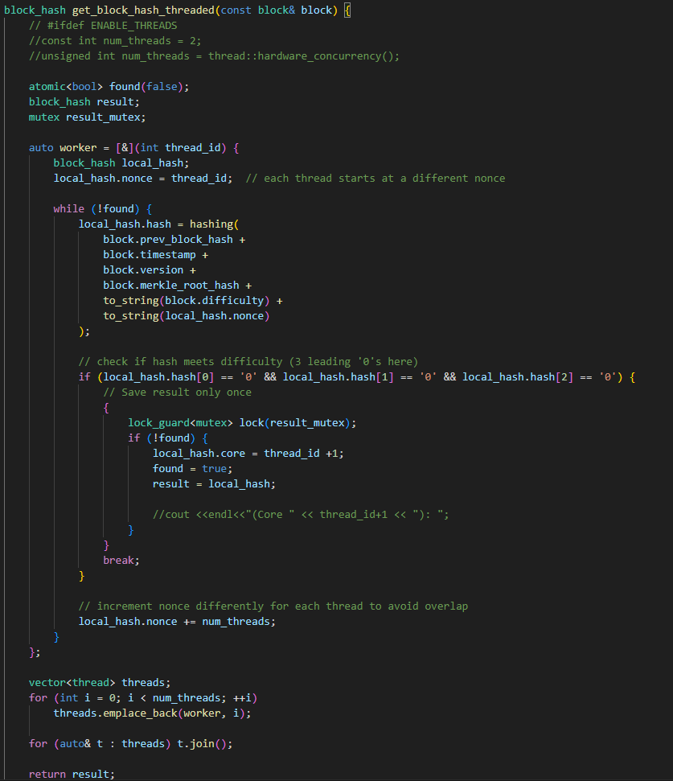
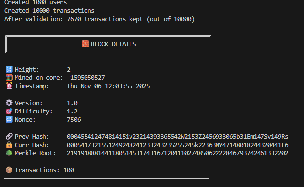
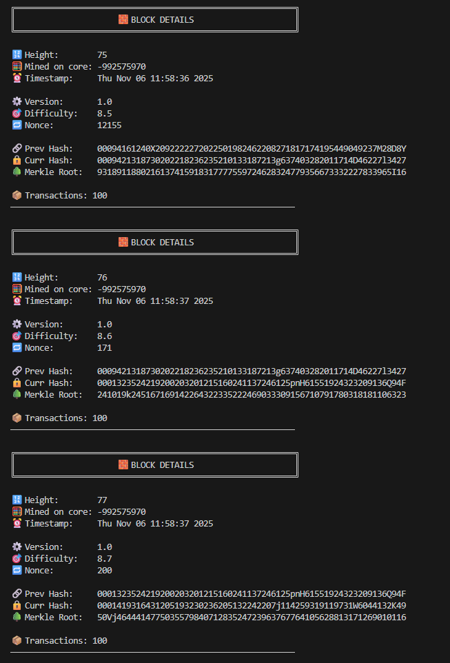
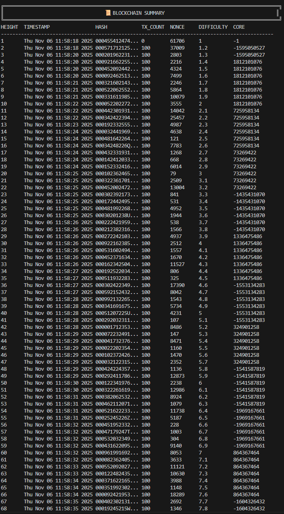
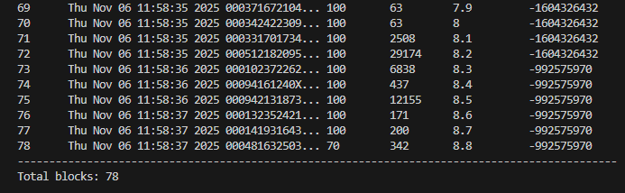
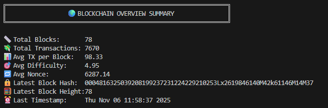

# Simple Blockchain — v0.2 (projektas ir santrauka)

Ši saugykla atnaujinta į versiją v0.2. Žemiau pateikiama aiški santrauka, ką mes įgyvendinome, kas yra įdiegta projekto šakoje. Originali v0.1 apžvalga palikta v0.1 release.

Rekomenduojame įjungti UTF-8 terminale, kad matytusi visa informacija.

Trumpai (tai, ką įgyvendinome)
- Sukūrėme paprastą centralizuotą blokų grandinę. Programa:
  1. Sugeneruoja ~1000 vartotojų (vardas, public_key, atsitiktinis balansas).
  2. Sugeneruoja ~10 000 transakcijų (transaction_id = hash(siuntėjas+gavėjas+amount)).
  3. Atlieka pre-validaciją: nustato, kurios transakcijos gali būti įdėtos į bloką.
  4. Formuoja blokus — kiekviename bloke gali būti iki 100 transakcijų.
  5. Atlieka kasimą (Proof-of-Work) naudodami projekto `hashing()` funkciją: ieškoma bloko maišos, prasidedančios bent trimis nuliais (`000...`).
  6. Įtraukia bloką, atnaujina balansus ir kartoja procesą tol, kol mempool tuščias arba neįmanoma įtraukti daugiau transakcijų.

Implemented / Įgyvendinta (v0.1)
- Centralizuota grandinė.
- Deterministinė `hashing()` funkcija naudojama transakcijų ID ir bloko maišai.
- Pre-validation: pašalinamos akivaizdžiai netinkamos transakcijos (neegzistuojantys vartotojai, neigiamos sumos, self-transfer, neteisingas transaction_id, dubliuoti ID).
- `add_block()` naudoja ne-destruktyvų mempool atrankos mechanizmą: shuffle + fallback (sort by amount) + rezervacijos logika, kad būtų išvengta netikėtų praradimų.

Ką dar reikėtų v0.2 (nurodyta užduotyje)
- Implementuoti tikrą Merkle Tree ir Merkle Root.
- Simuliuoti decentralizuotą kasimą: paruošti kelių kandidatinių blokų kasimą lygiagrečiai ir riboti laiką/iteracijas (pvz., 5 s) kiekvienam kandidatu.
- Sustiprinti transakcijų validaciją: nuoseklus balanso tikrinimas, plius kiti patikrinimai.

Kodo sprendimai ir pastabos (trumpai)
- Determinizmas: `transaction_id` yra deterministinis (hash be rand()), todėl validacija nesulaužo tx ID tarp paleidimų.
- Du sluoksniai validacijos: pre-validation (snapshot rezervacijos) ir final validation `add_block()` metu — taip imituojama mempool plausibility ir faktinė grandinės būsena.
- Multithreading: projekte yra `get_block_hash_threaded()` su fallback į viengubą variantą dėl portabilumo (senesni MinGW toolchain'ai). Instrukcijos, kaip įjungti multi-threaded kasimą, yra šiek tiek žemiau README skyriuje.

Paleidimas (pavyzdinė instrukcija)
1) Atidarykite PowerShell arba Windows Terminal.
2) Pereikite į projekto katalogą:
```powershell
cd 'C:\Users\User1\Documents\GitHub\blockchain\2'
3) Kompiliacija:
```powershell
g++ -std=c++17 -O2 -Wall -Wextra -o .\blockchain.exe .\main.cpp .\functions.cpp
```
4) Paleidimas:
```powershell
.\blockchain.exe
```
Pastaba: jei norite multi-threaded kasimo pagalbos ir turite modernų toolchain (MinGW-w64/ MSYS2 arba Linux), pridėkite `-pthread` prie komandos kompiliacijos metu.

Multithreadinimo funkcija:


Patikrinimai ir greiti testai
- Rekomenduojama pirmiausia paleisti su mažesniais skaičiais (pvz., 100 vartotojų, 1000 transakcijų) norint patikrinti logiką ir grąžinamus skaičius:
  - pakeiskite `generate_users(1000)` ir `generate_transactions(10000, users)` laikinai į mažesnius kiekius `main.cpp`.
- Po validacijos programa išveda: "After validation: X (out of Y)". Tai rodo, kiek tx praėjo pre-validation.

- Kodo struktūra (OOP, enkapsuliacija): `user` ir `transaction` yra klasėmis su getter'iais/setter'iais.
- Kasimo ir validavimo logika: validacija dviem sluoksniais, PoW veikia pagal sąlygą (leading zeros), nonce iteracijos matomos konsolėje.
- Rezultatai ir dokumentacija: README aiškiai paaiškina, ką padarėme.

Failai, į kuriuos reikėtų atkreipti dėmesį
- `main.cpp` — paleidimo logika, kiek generatorių ir paleidimų.
- `functions.cpp` — didžioji dalis logikos: hashing(), generate_*, validate_transactions(), add_block(), kasimo funkcijos.
- `header.h` — klasės ir tipai.

Paleisto kodo pavyzdys:







AI pagalba
- README ir kai kurios dokumentacinės dalys parengtos su AI pagalba; visa kodo logika ir implementacija padaryta rankomis.

