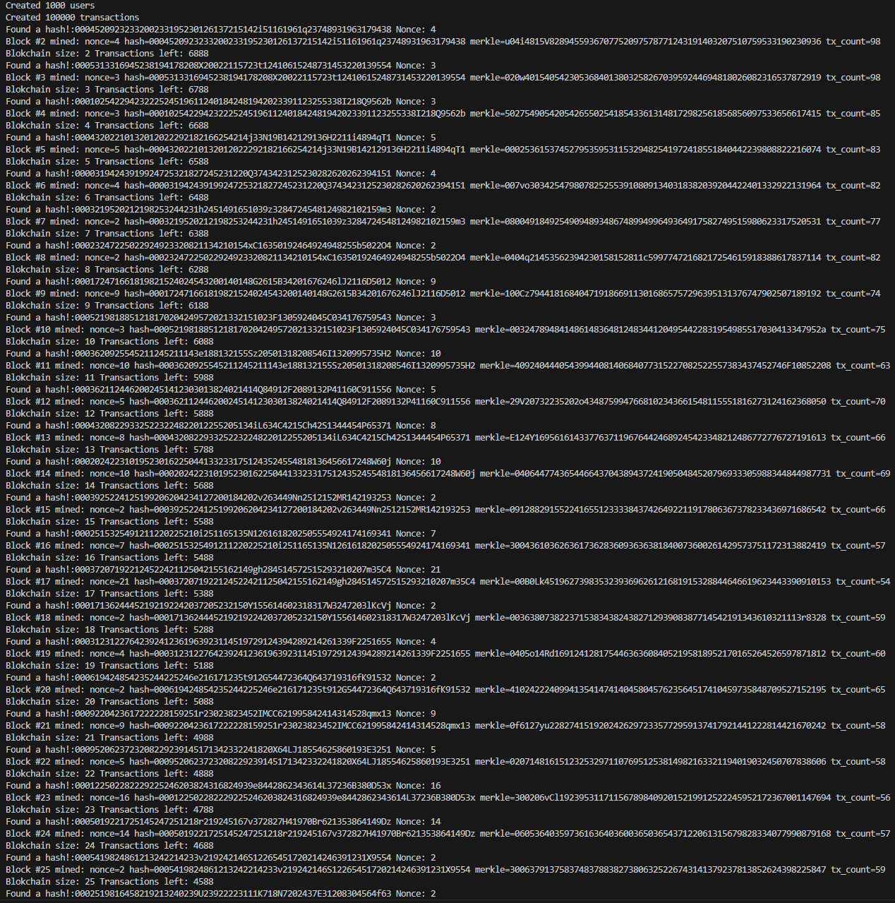

# Simple Blockchain — v0.1

Tai paprastas centralizuotos blokų grandinės (v0.1) demonstracinis projektas.

Šio leidimo apžvalga
- Centralizuota grandinė (vienas mazgas)
- Naudojama projekto maišos funkcija (`hashing`)
- Blokas susideda iš antraštės (header) ir turinio (body):
  - Header: `prev_block_hash`, `timestamp`, `version`, `merkle_root_hash` (supaprastinta), `nonce`, `difficulty`
  - Body: iki 100 transakcijų viename bloke (v0.1)
- Transakcija: `sender`, `receiver`, `amount`, `transaction_id` (maišos reikšmė)
- Konsolės išvestis: rodomas vartotojų/transakcijų sukūrimas, bloko kasimas ir įrašymas

Pastabos apie įgyvendinimą (v0.1)
- Programa parengta kaip centralizuotas demonstracinis įgyvendinimas. 
  1. Generuoja vartotojus (vardas, `public_key`, atsitiktinis balansas).
  2. Generuoja transakcijas (sukuria `transaction_id` kaip maišos reikšmę iš siuntėjo, gavėjo ir sumos).
  3. Formuoja blokus iš iki 100 transakcijų.
  4. Kasimas (Proof-of-Work): ieškoma bloko maišos, prasidedančios bent trimis nuliais (`000...`).
  5. Įtraukus transakcijas į bloką, atnaujinami vartotojų balansai.

Kaip paleisti (Windows PowerShell su g++)
```powershell
cd 'C:\Users\User1\Documents\GitHub\blockchain\2' (tik pavyzdys, jums reikia nueiti į aplanką, kuriame yra šis kodas)
g++ -std=c++17 -O2 -Wall -Wextra -o .\blockchain.exe .\main.cpp .\functions.cpp
.\blockchain.exe
```
Štai ką turėtume matyti:



Tolimesni patobulinimai (v0.2 versijai)
- Įdiegti tikrą Merkle medį ir apskaičiuoti Merkle root.
- Pagerinti transakcijų verifikaciją (patikrinti `transaction_id`, balanso patikra prieš įtraukiant į galimą blocką).
- Imituoti decentralizuotą kasimą: generuoti kelis kandidatinius blokus ir bandyti juos kasimo metu ribotą laiką.

AI pagalba
- Kai kurios refaktoringo idėjos ir README turinys parengti su AI pagalba; visa kodo logika ir sprendimai atlikti rankiniu būdu.

